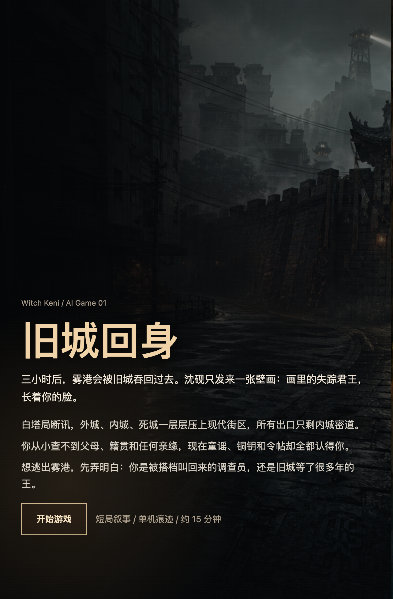
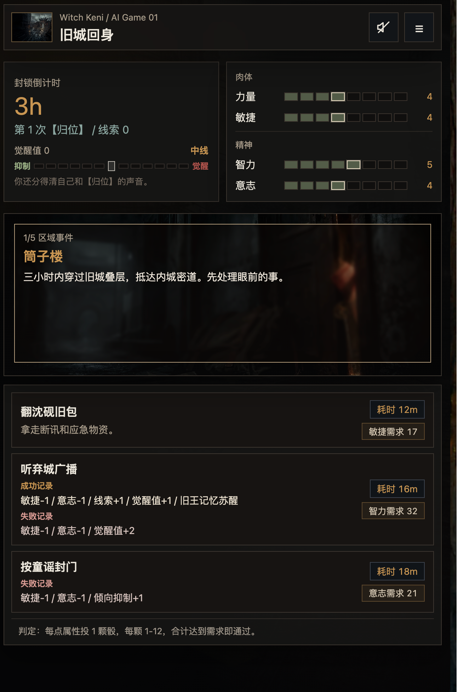
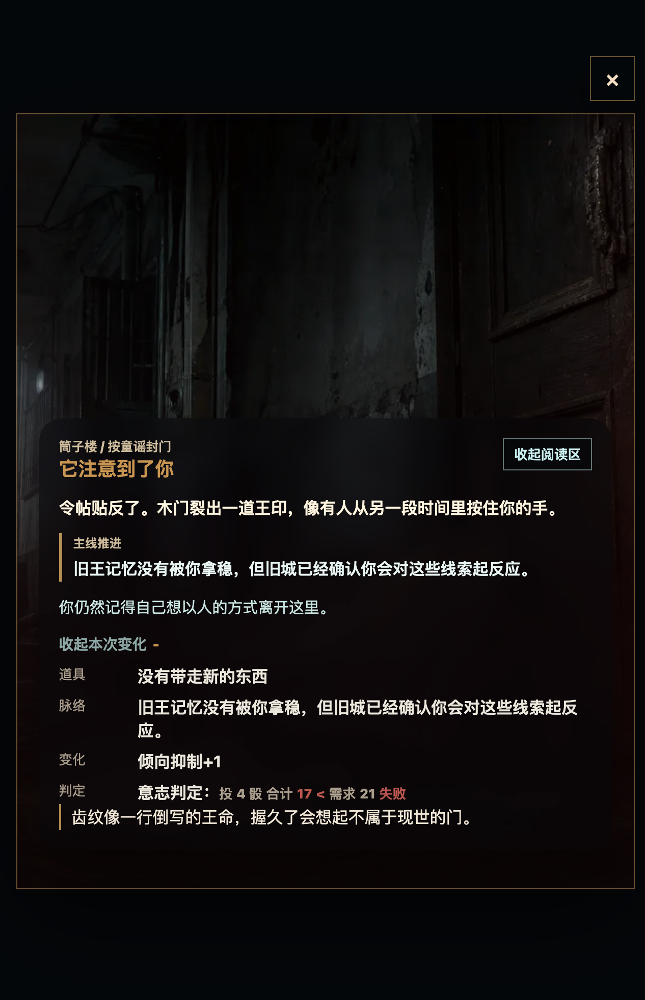

# 旧城回身

`Witch Keni / AI Game 01` 是一款约 15 分钟一局的单机 Web 叙事游戏。三小时后，白塔局将启动弃城封锁；玩家需要穿过雾港里层层压上的旧城区域，收集线索、处理道具和【归位】觉醒，最终抵达内城密道。

当前版本：`0.9.25`

## 预览







## 这一版有什么

- 前情提要首页：先交代沈砚、白塔局断讯、壁画旧王和三小时封锁，再进入本局。
- 短局核心循环：选择路线节点，打行动牌，承担属性、道具、线索、觉醒和时间后果。
- 四项属性检定：力量、敏捷、智力、意志按骰池判定；每点属性投 1 颗 1-12 骰，合计达到需求即通过。
- 【归位】轴：玩家会在抑制、中线、觉醒和失控之间移动，影响可选行动与叙事走向。
- 事件回执：每次行动后展示地点图、主线推进、本次变化和判定结果。
- 记忆式行动牌：未选择过的行动不提前暴露收益和成功率，重复游玩后会逐步显露成功/失败记录。
- 本地痕迹：上一局路线会保存在当前浏览器本地，转化为下一局的便签与遗物效果。
- 纯环境音频：顶部音频按钮可开启底噪、觉醒压力层、事件回执音和关键短波配音。
- 剧情后台：`story-dev.html` 用于审阅章节路线、角色关系、真相层和节点文案。

## 题材方向

游戏混合中式民俗恐怖、异常收容和短局 roguelite 痕迹。旧城令帖、归位铜钥、白塔短波、供桌、纸扎、壁画残照都会作为道具、征兆或事件回执出现。

表层目标是逃出雾港；深层问题是弄清楚玩家到底是被搭档叫回来的调查员，还是旧城等了很多年的失位旧王。

## 本地试玩

首次运行先安装依赖：

```bash
npm install
```

启动本地试玩：

```bash
npm run dev
```

打开 `http://127.0.0.1:4173`。

## 校验与构建

```bash
npm run check
npm run build
```

`npm run build` 会把 `index.html`、`story-dev.html`、`src/` 和 `assets/` 复制到 `dist/`，用于静态发布。

## 手机临时预览

```bash
npm run phone:preview
```

该命令会启动只监听 `127.0.0.1` 的只读预览服务，并通过 Cloudflare Quick Tunnel 生成临时 HTTPS 链接。终端会输出手机访问链接、一次性长分享码和停止方式。

手机保持 Shadowrocket 开启，打开终端里的 Cloudflare 链接，输入分享码即可。详细说明见 [docs/phone-preview.md](docs/phone-preview.md)。

## 发布到 Cloudflare Workers

Cloudflare Worker 应用 `codex-web-game001` 使用 Static Assets 承载游戏文件，并连接 GitHub 仓库 `chinnkenni/codex_web_game001`。

- 生产分支：`main`
- 构建命令：`npm run build`
- 静态资源目录：`dist`

只要把变更推送到 GitHub，Cloudflare Workers Builds 会自动构建和发布。项目是纯静态页面，当前不需要数据库、账号系统或后端服务。

## 项目结构

```text
.
├── index.html              # 游戏入口
├── story-dev.html          # 剧情开发后台
├── src/
│   ├── main.js             # 游戏逻辑
│   ├── styles.css          # 游戏界面样式
│   ├── story-dev-rewrite.js
│   └── story-dev.css
├── assets/
│   ├── audio/              # 环境音、回执音、短波配音
│   └── story/              # 事件回执地点图
├── docs/
│   ├── phone-preview.md
│   └── screenshots/
└── tools/
    ├── build-static.mjs
    ├── start-phone-preview.mjs
    └── generate-pure-audio.mjs
```

## 后续可扩展

- 增加更多路线节点、隐藏结局和跨局遗物。
- 把公共痕迹池、排行榜或跨设备同步接入 Cloudflare D1/KV/Worker。
- 继续扩写剧情后台，让节点文案、回执图和结局条件更容易审阅。
